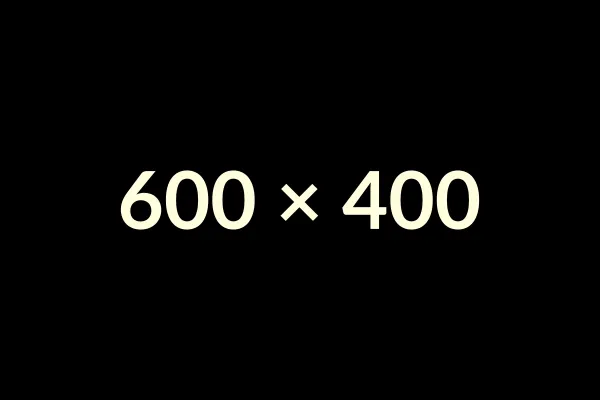

# Escala maior na ocarina

Este é o primeiro conteúdo da **L.May Ocarina Library**.

Estamos construindo uma biblioteca de conhecimento sobre ocarina.

## O que é uma escala maior?

A escala maior é uma das estruturas fundamentais da música tonal.

Ela pode ser entendida como uma sequência organizada de sete notas.

## Por que estudar escalas?

As escalas ajudam a compreender:

- a organização das notas;
- a relação entre os graus;
- a construção de melodias;
- a formação de tonalidades.

<!-- Imagem de teste será adicionada posteriormente. -->

## Como começar a estudar

Na ocarina, o estudo das escalas também permite associar o conhecimento teórico às posições dos dedos.

Comece lentamente e procure ouvir cada nota antes de avançar para a próxima.

---

## Continue estudando

Depois de compreender a escala maior, você pode aprofundar o estudo das notas e começar seus primeiros exercícios.

[Conhecendo as notas da ocarina](../conhecendo-as-notas-da-ocarina/)

[Primeiros exercícios na ocarina](../primeiros-exercicios-na-ocarina/)
